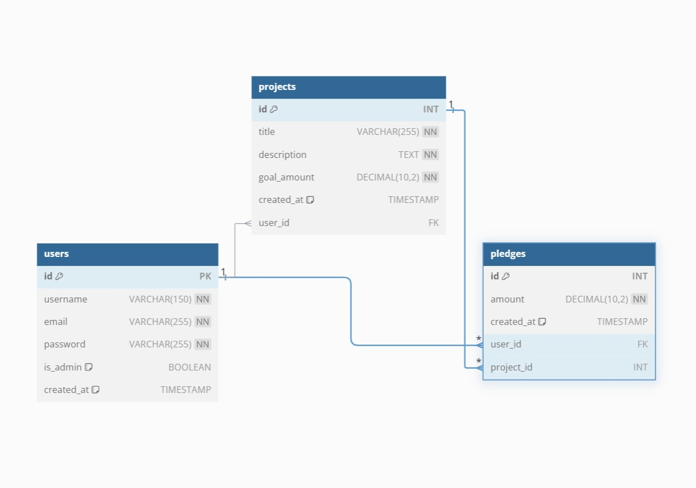

# Crowdfunding Back End
Kirby Thomson

# Link
https://crumbfund-18d9a25d981a.herokuapp.com/

## Planning:

### Concept/Name
CrumbFund

### Intended Audience/User Stories

Baker’s Story:
    As a passionate baker and product innovator, I want to raise funds to grow my business or develop new tools that can help other bakers. I’ll launch a project on BakeFund, offering exciting rewards like custom treats or early access to my innovations for backers who support my journey.

Backer’s Story:
    As a dedicated baking enthusiast, I want to support emerging bakers and creative innovators. By backing a project on BakeFund, I can enjoy delicious rewards like boxes of cookies or cupcakes, and even have the chance to try out new baking tools or ingredients before they hit the market.

### Front End Pages/Functionality

Home page:
  - Link to my user profile
  - List of projects to donate to 
  - Create account
  - Search projects 

Profile page:
  - List of all my pledges
  - My personal details- Name and email 
  - Delete account link  

Project page:
  - Name and project details with pictures/videos 
  - List of current pledges 
  - If I am the owner I can edit the project
  - If I am not the owner I can add a pledge  
---
### API Spec

| URL              | HTTP Method | Purpose               | Request Body         | Success Response Code | Authentication/Authorisation |
| ---              | ----------- | -------               | ------------         | --------------------- | ---------------------------- |
| /users           | POST        | Create a user         | User object          | 201                   | N/A                          |
| /users           | GET         | Get all users         | User objects         | 302                   | Admin                        |
| /users           | PUT         | Edit user details     | Username and password| 200                   | Must be logged in            |
| /users/pk/       | GET         | Get specific user     | User object          | 302                   | Admin                        |
| /users/pk/       | DELETE      | Delete a user         | N/A                  | 200                   | Must be logged in            |
| /projects        | POST        | Post a project        | Project object       | 201                   | Must be logged in            |
| /projects        | GET         | Find all projects     | N/A                  | 302                   | Must be logged in            |
| /projects/pk/    | GET         | Find a project        | Project object       | 302                   | Must be logged in            |
| /projects/pk/    | PUT         | Edit a project        | Project object       | 200                   | User only                    |
| /projects/pk/    | DELETE      | Delete a project      | N/A                  | 200                   | Must be logged in            |
| /api-token-auth/ | POST        | Gets user token       | Username and password| 302                   | User only                    |
| /pledges         | POST        | Posts a pledge        | Pledge object        | 200                   | Must be logged in            |
| /pledges/pk/     | GET         | Find a pledge         | Pledge object        | 302                   | Must be logged in            |
| /pledges/        | GET         | Find all pledges      | Pledge object        | 302                   | Must be logged in            |
| /pledges         | PUT         | Edit a pledge         | Pledge object        | 200                   | Must be logged in            |
| /pledges/pk/     | DELETE      | Delete a pledge       | Pledge object        | 200                   | User only- Time period       |
---
### DB Schema


---
 ## Step-by-Step Instructions: Registering a New User and Creating a New Project

To successfully register a new user and create a new project in the crowdfunding app, follow the steps below. Each step includes the endpoint, HTTP method, and example body data.

---
### Step 1: Register a New User

- **Endpoint**: `/users`
- **HTTP Method**: `POST`
- **Body Data**:
   ```json
   {
       "username": "test",
       "password": "testing123",
       "first_name": "Testy",
       "last_name": "McTest",
       "email": "test@test.com"
   }
**Response:**
201 Created: Indicates that the user has been successfully registered.

---
### Step 2: Authenticate to Obtain a Token

- **Endpoint**: `/api-token-auth/`
- **HTTP Method**: `POST`
- **Body Data**: 

    ```json
    {
    "username": "test",
    "password": "testing123"
    }
**Response:**
200 OK: Returns a token that must be used for subsequent authenticated requests.

Note: Copy the token from the response, as you will use it for authorisation in the next step.

---

### Step 3: Create a New Project

- **Endpoint**: `/projects`
- **HTTP Method**: `POST`
- **Authorization**: Add the token from Step 2 in the Auth Bearer Token
- **Body Data**: 
- 
    ```json
    {
    "title": "My First Project",
    "description": "This is a test project to demonstrate the creation of a new project.",
    "goal": 1000,
    "image": "http://example.com/image.jpg",
    "is_open": true,
    "date_created": "2024-10-27"
    }
**Response**: 201 Created: Indicates that the project has been successfully created.

---

### Screenshots


